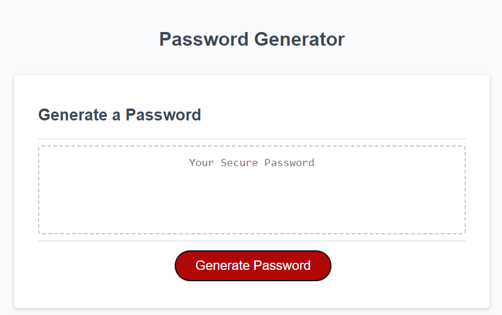

# <h1 align="center">simple-pass-generator</h1>

## Description

This project is to create a minimal and non-web transmitting password generated. Included options would be - <ul><li>Character selection from either lower/upper case, numerical and/or special chracters</li><li>Input validation</li></ul>

## Features
Input an expected length, and be presented with options for character types to include. Select all 4, or atleast 1 to continue. Password generated should be displayed once options completed. 

## Screenshot
 

## Live Demo
<a href="https://ryjmcnamee.github.io/simple-pass-generator/">See Here...</a>